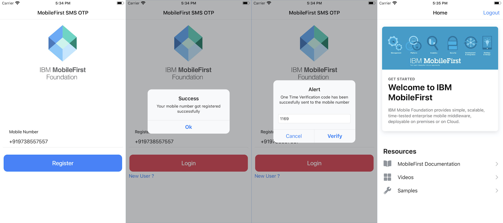
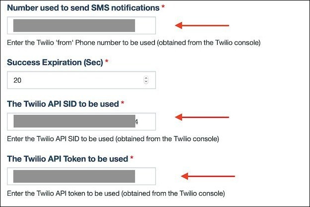

IBM MobileFirst Foundation
===
## SMS Mobile OTP

A sample Ionic 5.x and iOS Swift application demonstrating the Mobile Authentication feature using One Time Password, the use of the [SMS OTP Login](https://www.wikiwand.com/en/One-time_password) Security Check to protect an IBM MobileFirst Platform Resource Adapter. This will allow application to authenticate a user using SMS with the Twilo Messaging Service.

### Prerequisites
1. Understanding the IBM MobileFirst Foundation [Authentication and Security](https://mobilefirstplatform.ibmcloud.com/tutorials/en/foundation/8.0/authentication-and-security/).
2. Understanding the IBM MobileFirst Foundation [Java Adapters](https://mobilefirstplatform.ibmcloud.com/tutorials/en/foundation/8.0/adapters/java-adapters/).
3. Pre-installed IBM MobileFirst Foundation [development environment](https://mobilefirstplatform.ibmcloud.com/tutorials/en/foundation/8.0/setting-up-your-development-environment/)
4. Understanding the [Twilio Service](https://www.twilio.com/docs/usage/api#authenticate-with-http)

### Configuring the Adapter

- Deploy [SMSOTP Adapter](./SmsOTPAdapter) by running following commands in the project's root directory using command line:
    * Run `cd SmsOTPAdapter`
    * Run `mfpdev adapter build`
    * Run `mfpdev adapter deploy`

- From your command line run `mfpdev server console` - this command will open your server console.
  * From the Adapters menu click on *SMS OTP Adapter* and navigate to *Security Checks* tab.
  * Here you will find place to add *Twilio API SID*, *Twilio API Token* and *From phone Number*.
  * These API Credentials and Phone number can be retreived from [Twilio Console](https://www.twilio.com/console)
  * 

### Usage

#### Ionic

1. From a command-line window, navigate to the project's root folder and run the following commands:
    - `cd IonicSample` - to navigate to ionic sample folder.
    - `ionic cordova platform add ios` or `ionic cordova platform add android` - to add a platform.
    - `mfpdev app register` - to register the application.
    - `ionic cordova run` - to run the application.

2. Register and Login to the application with your personal mobile phone number.

#### iOS Swift

1. From a command-line window, navigate to the project's root folder and run the following commands:
    - `cd SwiftiOSSample` - to navigate to iOS sample folder.
    - `pod update` followed by `pod install` - to add the MobileFirst SDK.
    - `mfpdev app register` - to register the application.

2. Run the application in the iOS Simulator or physical device. Register & Login to the application with your personal mobile phone number.

## Version
- Ionic 5.1.0
- Swift 5.0

## Supported Versions
IBM MobileFirst Foundation 8.0

## Licence
Copyright 2020 IBM Corp.

Licensed under the Apache License, Version 2.0 (the "License");
you may not use this file except in compliance with the License.
You may obtain a copy of the License at

http://www.apache.org/licenses/LICENSE-2.0

Unless required by applicable law or agreed to in writing, software
distributed under the License is distributed on an "AS IS" BASIS,
WITHOUT WARRANTIES OR CONDITIONS OF ANY KIND, either express or implied.
See the License for the specific language governing permissions and
limitations under the License.s